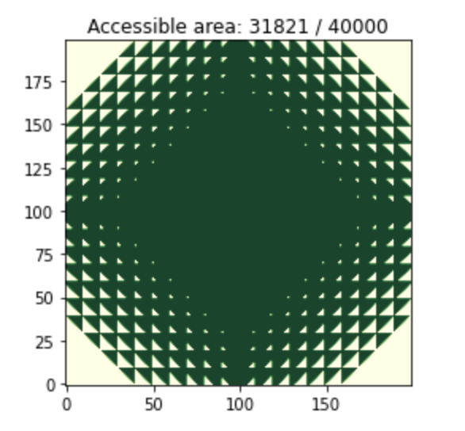

## Calmidvn

### Question:

There is a robot which can move around on a grid. The robot is placed at point (0,0). From (x, y) the robot can move to (x+1, y), (x-1, y), (x, y+1), and (x, y-1). 

Some points are dangerous and contain EMP Mines. To know which points are safe, we check whether the sum digits of abs(x) plus the sum of the digits of abs(y) are less than or equal to 23. 

For example, the point (59, 75) is not safe because 5 + 9 + 7 + 5 = 26, which is greater than 23. The point (-51, -7) is safe because 5 + 1 + 7 = 13, which is less than 23. 

**How large is the area that the robot can access?**

### Solution:
To find all access points that the robot can go. We need to follow some steps:

1. Try to look at all points on the grid to check if it is safe. we named "really_safe_point"
2. From a really_safe_point, we can go **UP (x,y+1)**, **DOWN (x, y-1)**, **LEFT (x-1, y)**, **RIGHT (x+1, y)** to check if any these points is "really_safe_point"
3. Finally, we should count "really_safe_point" points only
4. Virtualize the Grid

### Result: with Grid 100x100

